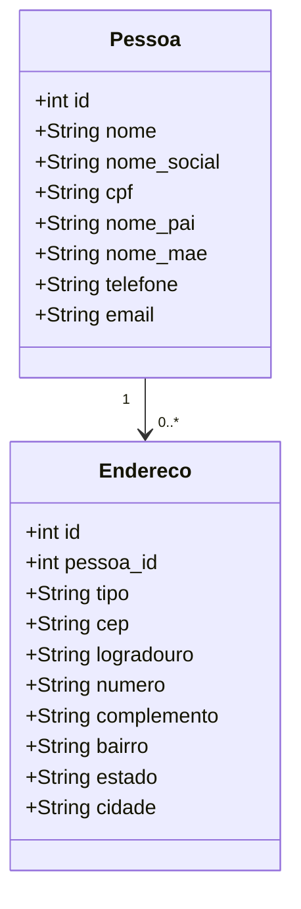

```markdown
# Sistema de Cadastro de Pessoas

Este projeto é um sistema de cadastro de pessoas que permite pesquisar, cadastrar, visualizar e editar informações de pessoas e seus respectivos endereços. O sistema foi desenvolvido utilizando Laravel no back-end e VueJS no front-end, seguindo o padrão Inertia. Para a estilização da aplicação, foi utilizado o Vuetify, e o banco de dados utilizado é o MySQL.

## Funcionalidades

- **Pesquisa de Pessoas**: Permite a pesquisa de pessoas pelo identificador do cadastro, nome (parte ou completo) ou CPF.
- **Cadastro de Pessoas**: Permite o cadastro de novas pessoas com os seguintes campos:
    - Nome
    - Nome Social
    - CPF
    - Nome do Pai
    - Nome da Mãe
    - Telefone
    - Email
- **Cadastro de Endereços**: Após cadastrar uma pessoa, é possível cadastrar endereços residenciais e comerciais. O preenchimento do endereço é facilitado pela consulta de CEP via API.
    - Tipo de Endereço (Residencial ou Comercial)
    - CEP
    - Logradouro
    - Número
    - Complemento
    - Bairro
    - Estado
    - Cidade
- **Visualização de Dados da Pessoa**: Permite visualizar os dados da pessoa pesquisada e seus respectivos endereços.
- **Edição de Endereços**: Permite editar os endereços da pessoa e manter um histórico de todos os endereços cadastrados, mesmo após alteração.

## Tecnologias Utilizadas

- **Laravel**: Framework PHP para o back-end.
- **VueJS**: Framework JavaScript para o front-end.
- **Inertia**: Biblioteca para construir single-page applications utilizando VueJS e Laravel.
- **Vuetify**: Biblioteca de componentes VueJS para estilização.
- **MySQL**: Banco de dados relacional.

## Instalação e Configuração

### Pré-requisitos

- PHP >= 8.3
- Composer
- Node.js
- NPM
- MySQL

### Passos para Instalação

1. Clone o repositório:
   ```bash
   git clone https://github.com/seu-usuario/cadastro-pessoas.git
   cd cadastro-pessoas
   composer install
   npm install
   npm run dev
   cp .env.example .env
   php artisan key:generate
   ```

2. Configure o arquivo `.env` com as informações do seu banco de dados:
   ```
   DB_CONNECTION=mysql
   DB_HOST=127.0.0.1
   DB_PORT=3306
   DB_DATABASE=cadastro_pessoas
   DB_USERNAME=seu_usuario
   DB_PASSWORD=sua_senha
   ```

3. Execute as migrações do banco de dados:
   ```bash
   php artisan migrate
   ```

4. Adicione o Vuetify ao projeto:
   ```bash
   vue add vuetify
   ```

5. Inicie o servidor:
   ```bash
   php artisan serve
   ```

6. Acesse a aplicação em `http://localhost:8000`.

## Estrutura do Banco de Dados



## Rotas

As rotas principais para o sistema são as seguintes:

- `GET /` - Página inicial com a lista de pessoas.
- `GET /pessoas` - Lista de pessoas.
- `GET /pessoas/create` - Formulário de cadastro de pessoa.
- `POST /pessoas` - Armazena uma nova pessoa.
- `GET /pessoas/{id}` - Visualização de dados da pessoa.
- `GET /pessoas/{id}/edit` - Formulário de edição de pessoa.
